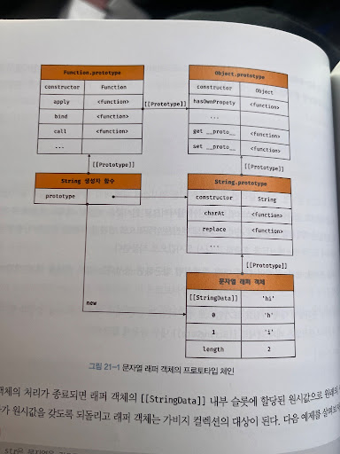

# 21장 빌트인 객체

## 표준 빌트인 객체

자바스크립트는 Object, String, Number, Boolean, Symbol, Date, Math, RegExp, Array, Map/Set, WeakMap/WeakSet, Function, Promise, Reflect, Proxy, JSON, Error 등 40여 개의 표준 빌트인 객체를 제공한다.

Math, Reflect, JSON을 제외한 표준 빌트인 객체는 모두 인스턴스를 생성할 수 있는 생성자 함수 객체다.

**프로토타입 메서드와 정적 메서드**를 제공하고 정적 메서드만 제공하며, **생성자 함수가 아닌 표준 빌트인 객체는 정적 메서드**만 제공한다.

## 호스트 객체

## 사용자 정의 객체

<details>
<summary>예제</summary>
<div markdown="1">

```
/* 1) 기본/래퍼/날짜/정규식 */
const obj = new Object();
const fn = new Function("a", "b", "return a + b;");
const arr = new Array(1, 2, 3);
const boolObj = new Boolean(false);
const numObj = new Number(123);
const strObj = new String("hi");
const date = new Date();
const regex = new RegExp("^a+$");

/* 2) Error 계열 */
const err = new Error("boom");
const aggregateErr =
  typeof AggregateError !== "undefined"
    ? new AggregateError([new Error("a"), new Error("b")], "many")
    : null;
const evalErr = new EvalError("eval");
const rangeErr = new RangeError("range");
const refErr = new ReferenceError("ref");
const syntaxErr = new SyntaxError("syntax");
const typeErr = new TypeError("type");
const uriErr = new URIError("uri");

/* 3) 컬렉션 */
const map = new Map([["k", "v"]]);
const set = new Set([1, 1, 2]);
const weakMap = new WeakMap();
const weakSet = new WeakSet();

/* 4) Promise / Proxy / WeakRef / FinalizationRegistry */
const promise = new Promise((resolve) => resolve(1));
const proxy = new Proxy({ x: 1 }, { get: (t, p) => (p in t ? t[p] : 0) });
const finalizationRegistry =
  typeof FinalizationRegistry !== "undefined"
    ? new FinalizationRegistry((held) => console.log("finalized:", held))
    : null;
const weakRef = typeof WeakRef !== "undefined" ? new WeakRef({ y: 2 }) : null;

/* 5) 바이너리/버퍼/뷰 */
const arrayBuffer = new ArrayBuffer(8);
const sharedArrayBuffer =
  typeof SharedArrayBuffer !== "undefined" ? new SharedArrayBuffer(8) : null;
const dataView = new DataView(arrayBuffer);

/* 6) TypedArray */
const int8 = new Int8Array(4);
const uint8 = new Uint8Array(4);
const uint8c = new Uint8ClampedArray(4);
const int16 = new Int16Array(4);
const uint16 = new Uint16Array(4);
const int32 = new Int32Array(4);
const uint32 = new Uint32Array(4);
const float32 = new Float32Array(4);
const float64 = new Float64Array(4);
const bigInt64 =
  typeof BigInt64Array !== "undefined" ? new BigInt64Array(4) : null;
const bigUint64 =
  typeof BigUint64Array !== "undefined" ? new BigUint64Array(4) : null;

/* 7) Intl (환경에 따라 일부 없음) */
const intlCollator =
  typeof Intl !== "undefined" && Intl.Collator ? new Intl.Collator("ko-KR") : null;
const intlDateTimeFormat =
  typeof Intl !== "undefined" && Intl.DateTimeFormat ? new Intl.DateTimeFormat("ko-KR") : null;
const intlDisplayNames =
  typeof Intl !== "undefined" && Intl.DisplayNames ? new Intl.DisplayNames(["ko"], { type: "region" }) : null;
const intlListFormat =
  typeof Intl !== "undefined" && Intl.ListFormat ? new Intl.ListFormat("ko-KR") : null;
const intlLocale =
  typeof Intl !== "undefined" && Intl.Locale ? new Intl.Locale("ko-KR") : null;
const intlNumberFormat =
  typeof Intl !== "undefined" && Intl.NumberFormat ? new Intl.NumberFormat("ko-KR") : null;
const intlPluralRules =
  typeof Intl !== "undefined" && Intl.PluralRules ? new Intl.PluralRules("ko-KR") : null;
const intlRelativeTimeFormat =
  typeof Intl !== "undefined" && Intl.RelativeTimeFormat ? new Intl.RelativeTimeFormat("ko-KR", { numeric: "auto" }) : null;
const intlSegmenter =
  typeof Intl !== "undefined" && Intl.Segmenter ? new Intl.Segmenter("ko-KR") : null;

/* 8) WebAssembly (환경에 따라 없음) */
let wasmModule = null;
let wasmInstance = null;
let wasmMemory = null;
let wasmTable = null;
let wasmGlobal = null;
let wasmCompileError = null;
let wasmLinkError = null;
let wasmRuntimeError = null;

if (typeof WebAssembly !== "undefined") {
  const wasmBytes = new Uint8Array([0x00, 0x61, 0x73, 0x6d, 0x01, 0x00, 0x00, 0x00]); // 최소 헤더
  wasmModule = new WebAssembly.Module(wasmBytes);
  wasmInstance = new WebAssembly.Instance(wasmModule);
  wasmMemory = new WebAssembly.Memory({ initial: 1 });
  wasmTable = new WebAssembly.Table({ element: "funcref", initial: 1 });
  wasmGlobal = WebAssembly.Global ? new WebAssembly.Global({ value: "i32", mutable: true }, 7) : null;

  wasmCompileError = new WebAssembly.CompileError("compile");
  wasmLinkError = new WebAssembly.LinkError("link");
  wasmRuntimeError = new WebAssembly.RuntimeError("runtime");
}

/* (참고) Math/JSON/Reflect/Atomics는 생성자 아님, Symbol/BigInt는 new 불가 */

```

</div>
</details>

## 원시값과 래퍼 객체

원시값인 문자열, 숫자, 불리언 등이 있는데도 불구하고 String, Number, Boolean 등의 표준 빌트인 생성자 함수가 존재하는 이유는 무엇일까?



자바스크립트 엔진은 원시값인 문자열, 숫자, 불리언 값에 대해 마침표 표기법(.)으로 접근하는 순간, 일시적으로 연관된 객체(래퍼 객체)를 생성하여 프로퍼티나 메서드를 사용할 수 있게 하고, 처리가 끝나면 다시 원시값으로 되돌립니다.

단계 별 정리를 해보자면.

1단계 선언

```
const str = 'hi';
```

- 메모리에는 단순한 문자열 원시값 'hi' 만 존재합니다.
- 이 시점에서는 프로퍼티나 메서드를 가질 수 없습니다.

2단계 접근 및 래퍼 객체 생성

```
console.log(str.toUpperCase()); // 접근 발생!
```

- 마침표(.)를 찍는 순간, 자바스크립트 엔진은 암묵적으로 new String('hi')를 실행합니다.
- 래퍼 객체 생성: 객체가 생성되고 객체의 [[StringData]] 내부 슬롯에 원시값 'hi'가 할당됩니다.
- 메서드 실행: 생성된 객체는 프로토타입 체인(String.prototype $\rightarrow$ Object.prototype)을 타고 올라가 toUpperCase 메서드를 찾아 실행합니다.

3단계 복구 및 파괴

- 메서드 호출이 종료되면, 래퍼 객체의 [[StringData]]에 있던 값을 다시 원시값으로 되돌립니다.
- 사용된 임시 래퍼 객체는 참조하는 곳이 없어지므로 가비지 컬렉션(Garbage Collection) 의 대상이 되어 메모리에서 사라집니다.

## 전역객체

코드가 실행되기 이전 단계에 자바스크립트 엔진에 의해 어떤 객체보다도 먼저 생성되는 특수한 객체이며, 어떤 객체에도 속하지 않은 최상위 객체다.

브라우저 환경에서는 window(또는 self, this, frames)가 전역 객체다.

Node.js 환경에서는 global이 전역 객체다.

ES11에서는 globalThis가 전역 객체를 가리키는 표준 사양으로 도입되었다.

```
// 브라우저 환경
globalThis === this   // true
globalThis === window // true
globalThis === self   // true
globalThis === frames // true

// Node.js 환경(12.0.0 이상)
globalThis === this   // true
globalThis === global // true

```

전역 객체는 표준 빌트인 객체와 환경에 따른 호스트 객체(클라이언트 Web API, Node.js의 호스트 API), 그리고 var 키워드로 선언한 전역 변수와 전역 함수를 프로퍼티로 갖는다.

계층적 구조상 어떤 객체에도 속하지 않은 모든 빌트인 객체(표준 빌트인 객체와 호스트 객체)의 최상위 객체다. 단, 전역 객체가 최상위 객체라는 것은 프로토타입 상속 관계상에서 최상위 객체라는 의미가 아니다.

전역 객체는 개발자가 의도적으로 생성할 수 없다. 즉, 전역 객체를 생성할 수 있는 생성자 함수가 제공되지 않는다.

전역 객체의 프로퍼티를 참조할 때 window(또는 global)을 생략할 수 있다.

```
// 문자열 'F'를 16진수로 해석하여 10진수로 변환하여 반환한다.
window.parseInt('F', 16); // -> 15
// window.parseInt는 parseInt로 호출할 수 있다.
parseInt('F', 16); // -> 15
```

전역 객체는 Object, String, Number, Boolean, Function, Array, RegExp, Date, Math, Promise 등 모든 표준 빌트인 객체를 프로퍼티로 가지고 있다.

자바스크립트 실행 환경(브라우저 또는 Node.js 환경)에 따라 추가적인 프로퍼티와 메서드를 갖는다. 브라우저 환경에서는 DOM, BOM, Canvas, XMLHttpRequest, fetch, requestAnimationFrame, SVG, Web Storage, Web Component, Web worker와 같은 클라이언트 사이드 Web API를 호스트 객체로 제공하고 Node.js에서는 고유의 API를 호스트 객체로 제공한다.
var 키워드로 선언한 전역 변수와 선언하지 않은 변수에 값을 할당한 암묵적 전역, 그리고 전역 함수는 전역 객체의 프로퍼티가 된다.

```
// var 키워드로 선언한 전역 변수
var foo = 1;
console.log(window.foo); // 1

// 선언하지 않은 변수에 값을 암묵적 전역. bar는 전역 변수가 아니라 전역 객체의 프로퍼티다.
bar = 2; // window.bar = 2
console.log(window.bar); // 2

// 전역 함수
function baz() { return 3; }
console.log(window.baz()); // 3
```

빌트인 전역 프로퍼티
빌트인 전역 프로퍼티(built-in global property)는 전역 객체의 프로퍼티를 의미한다. 주로 애플리케이션 전역에서 사용하는 값들을 제공한다.

```
Infinity
// 전역 프로퍼티는 window를 생략하고 참조할 수 있다.
console.log(window.Infinity === Infinity); // true

// 양의 무한대
console.log(3/0); // Infinity
// 음의 무한대
console.log(-3/0); // -Infinity
// Infinity는 숫자값이다.
console.log(typeof Infinity); // number
무한대를 나타내는 숫자값 Infinity를 갖는다.

NaN

console.log(window.NaN); // NaN

console.log(Number('xyz')); // NaN
console.log(1 \* 'string'); // NaN
console.log(typeof NaN); // number
숫자가 아님(Not-a-Number)을 나타내는 숫자값 NaN을 갖는다. NaN 프로퍼티는 Number.NaN 프로퍼티와 같다.

undefined

console.log(window.undefined); // undefined

var foo;
console.log(foo); // undefined
console.log(typeof undefined); // undefined
원시 타입 undefined를 값으로 갖는다.

빌트인 전역 함수
빌트인 전역 함수(built-in global function)는 애플리케이션 전역에서 호출할 수 있는 함수로서 전역 객체의 메서드다.

대표적인 빌트인 전역 함수로는 eval, isFinite, isNaN, parseFloat, parseInt, encodeURI/decodeURI, encodeURIComponent/decodeURIComponent 등이 있다.

eval

// 표현식인 문
eval('1 + 2;'); // 3

// 표현식이 아닌 문
eval('var x = 5;'); // undefined

// eval 함수에 의해 런타임에 변수 선언문이 실행되어 x 변수가 선언됨
console.log(x); // 5

// 객체 리터럴은 반드시 괄호로 둘러싼다.
const o = eval('({ a: 1 })');
console.log(o); // {a: 1}

// 함수 리터럴은 반드시 괄호로 둘러싼다.
const f = eval('(function() { return 1; })');
console.log(f()); // 1
```

eval 함수는 자바스크립트 코드를 나타내는 문자열을 인수로 전달받는다. 전달받은 문자열 코드가 표현식이라면 런타임에 해당 코드를 평가하여 값을 생성하고, 표현식이 아닌 문이라면 런타임에 실행한다.

eval 함수는 기존의 스코프를 런타임에 동적으로 수정한다. 즉, 호출된 위치에서 eval 함수에 전달된 코드는 마치 평가 시점에 해당 위치에서 작성된 것처럼 동작한다.

```
const x = 1;

function foo() {
// eval 함수는 런타임에 foo 함수의 스코프를 동적으로 수정한다.
  eval('var x = 2;');
  console.log(x); // 2
}

foo();
console.log(x); // 1
```

단, strict mode에서는 eval 함수는 기존의 스코프를 수정하지 않고 eval 함수 자신의 자체적인 스코프를 생성한다. 그리고 eval 함수에 전달된 코드가 let, const 키워드를 사용한 변수 선언문이라면 암묵적으로 strict mode가 적용된다.

한편, eval 함수를 통해 사용자로부터 입력받은 콘텐츠(코드)를 실행하는 것은 보안에 매우 취약하다. 또한 자바스크립트 엔진에 의한 최적화가 수행되지 않아 처리 속도도 느리다. 따라서 eval 함수의 사용은 가급적 자제하는 것이 좋다.

isFinite

isFinite 함수는 전달받은 인수가 정상적인 유한수인지 검사하여 결과를 불리언 타입으로 반환한다. 전달받은 인수의 타입이 숫자가 아닌 경우, 숫자로 타입 변환한 후 검사를 수행한다.

```
// 인수가 유한수이면 true를 반환한다.
isFinite(0); // -> true
isFinite(2e64); // -> true
isFinite('10'); // -> true: '10' → 10
isFinite(null); // -> true: null → 0

// 인수가 무한수 또는 NaN으로 평가되는 값이라면 false를 반환한다.
isFinite(Infinity); // -> false
isFinite(-Infinity); // -> false
isFinite(NaN); // -> false
isFinite('Hello'); // -> false

isNaN

// 숫자
isNaN(NaN); // -> true
isNaN(10); // -> false

// 문자열
isNaN('blabla'); // -> true: 'blabla' => NaN
isNaN('10'); // -> false: '10' => 10
isNaN('10.12'); // -> false: '10.12' => 10.12
isNaN(''); // -> false: '' => 0
isNaN(' '); // -> false: ' ' => 0

// 불리언
isNaN(true); // -> false: true → 1
isNaN(null); // -> false: null → 0

// undefined
isNaN(undefined); // -> true: undefined => NaN

// 객체
isNaN({}); // -> true: {} => NaN
isNaN 함수는 전달받은 인수가 NaN인지 검사하여 그 결과를 불리언 타입으로 반환한다. 전달받은 인수의 타입이 숫자가 아닌 경우, 숫자로 타입 변환한 후 검사를 수행한다.

parseFloat

// 문자열을 실수로 해석하여 반환한다.
parseFloat('3.14'); // -> 3.14
parseFloat('10.00'); // -> 10

// 공백으로 구분된 문자열은 첫 번째 문자열만 변환한다.
parseFloat('34 45 66'); // -> 34
parseFloat('40 years'); // -> 40

// 첫 번째 문자열을 숫자로 변환할 수 없다면 NaN을 반환한다.
parseFloat('He was 40'); // -> NaN
parseFloat 함수는 전달받은 문자열 인수를 부동 소수점 숫자(실수)로 해석하여 반환한다.

parseInt

// 문자열을 정수로 해석하여 반환한다.
parseInt('10'); // -> 10
parseInt('10.123'); // -> 10

// 10'을 2진수로 해석하고 그 결과를 10진수 정수로 반환한다
parseInt('10', 2); // -> 2
// '10'을 8진수로 해석하고 그 결과를 10진수 정수로 반환한다
parseInt('10', 8); // -> 8
// '10'을 16진수로 해석하고 그 결과를 10진수 정수로 반환한다
parseInt('10', 16); // -> 16
```

parseInt 함수는 전달받은 문자열 인수를 정수로 해석하여 반환한다. 두 번째 인수로 진법을 나타내는 기수(2 ~ 36)를 전달할 수 있다.

```
const x = 15;

// 10진수 15를 2진수로 변환하여 그 결과를 문자열로 반환한다.
x.toString(2); // -> '1111'
// 문자열 '1111'을 2진수로 해석하고 그 결과를 10진수 정수로 반환한다.
parseInt(x.toString(2), 2); // -> 15
```

기수를 지정하여 10진수 숫자를 특정 진법의 문자열로 변환하여 반환하려면 Number.prototype.toString 메서드를 사용한다.

```
// 16진수 리터럴 '0xf'를 16진수로 해석하고 10진수 정수로 그 결과를 반환한다.
parseInt('0xf'); // -> 15
// 위 코드와 같다.
parseInt('f', 16); // -> 15

// 2진수 리터럴(0b로 시작)은 제대로 해석하지 못한다. 0 이후가 무시된다.
parseInt('0b10'); // -> 0
// 8진수 리터럴(ES6에서 도입. 0o로 시작)은 제대로 해석하지 못한다. 0 이후가 무시된다.
parseInt('0o10'); // -> 0
```

두 번째 인수로 진법을 나타내는 기수를 지정하지 않더라도, 첫 번째 인수로 전달한 문자열이 "0x" 또는 "0X"로 시작한다면 16진수로 해석하여 10진수 정수로 반환한다. 하지만 2진수 리터럴과 8진수 리터럴은 제대로 해석하지 못한다.

encodeURI / decodeURI

```
// 완전한 URI
const uri = 'http://example.com?name=이웅모&job=programmer&teacher';

// encodeURI 함수는 완전한 URI를 전달받아 이스케이프 처리를 위해 인코딩한다.
const enc = encodeURI(uri);
console.log(enc);
// http://example.com?name=%EC%9D%B4%EC%9B%85%EB%AA%A8&job=programmer&teacher

// decodeURI 함수는 인코딩된 완전한 URI를 전달받아 이스케이프 처리 이전으로 디코딩한다.
const dec = decodeURI(enc);
console.log(dec);
// http://example.com?name=이웅모&job=programmer&teacher
```

encodeURI 함수는 완전한 URI를 문자열로 전달받아 이스케이프 처리를 위해 인코딩한다. 여기서 인코딩이란 URI의 문자들을 이스케이프 처리하는 것을 의미하며, 이스케이프 처리는 네트워크를 통해 정보를 공유할 때 어떤 시스템에서도 읽을 수 있는 아스키 문자 셋으로 변환하는 것이다.

한편, decodeURI 함수는 인코딩된 URI를 인수로 전달받아 이스케이프 처리 이전으로 디코딩한다.

단, encodeURI 함수는 매개변수로 전달된 문자열을 완전한 URI로 간주한다. 따라서 쿼리 스트링 구분자로 사용되는 =, ?, &를 인코딩하지 않는다.

encodeURIComponent / decodeURIComponent

```
// URI의 쿼리 스트링
const uriComp = 'name=이웅모&job=programmer&teacher';

// encodeURIComponent 함수는 인수로 전달받은 문자열을 URI의 구성요소인 쿼리 스트링의 일부로 간주한다.
// 따라서 쿼리 스트링 구분자로 사용되는 =, ?, &까지 인코딩한다.
let enc = encodeURIComponent(uriComp);
console.log(enc);
// name%3D%EC%9D%B4%EC%9B%85%EB%AA%A8%26job%3Dprogrammer%26teacher

let dec = decodeURIComponent(enc);
console.log(dec);
// 이웅모&job=programmer&teacher
```

encodeURIComponent 함수는 인수로 전달된 문자열을 URI의 구성요소인 쿼리 스트링의 일부로 간주한다. 따라서 쿼리 스트링 구분자로 사용되는 =, ?, & 까지 인코딩한다. decodeURIComponent 함수는 매개변수로 전달된 URI 구성요소를 디코딩한다.

암묵적 전역
암묵적 전역(implicit global)이란 선언하지 않은 식별자에 값을 할당할 때 해당 식별자가 자동으로 전역 객체의 프로퍼티가 되어 마치 전역 변수처럼 동작하는 현상을 말한다.

```
var x = 10; // 전역 변수

function foo() {
// 선언하지 않은 식별자에 값을 할당
y = 20; // window.y = 20;
}

foo();

// 선언하지 않은 식별자 y를 전역에서 참조할 수 있다.
console.log(x + y); //
```

위 예제에서 foo 함수 내부에 선언하지 않은 식별자 y에 값을 할당하고 있다. 이때 자바스크립트 엔진은 y 변수의 선언을 찾기 위해 먼저 스코프 체인을 통해 선언된 변수인지 확인한다. 하지만 foo 함수의 스코프와 전역 스코프 어디에서도 y 변수의 선언을 찾을 수 없으므로 참조 에러(ReferenceError)가 발생할 것 같지만 그렇지 않다.

이는 자바스크립트 엔진이 y = 20을 window.y = 20으로 해석하여 전역 객체의 프로퍼티 y를 동적으로 생성하기 때문이다.
암묵적 전역으로 생성된 y는 전역 객체의 프로퍼티이기 때문에 delete 연산자로 삭제할 수 있다. 하지만 전역 변수는 delete 연산자로 삭제할 수 없다.

```
var x = 10; // 전역 변수

function foo() {
// 선언하지 않은 식별자에 값을 할당
y = 20; // window.y = 20;
console.log(x + y);
}

foo(); // 30

console.log(window.x); // 10
console.log(window.y); // 20

delete x; // 전역 변수는 삭제되지 않는다.
delete y; // 프로퍼티는 삭제된다.

console.log(window.x); // 10
console.log(window.y); // undefined
또한 암묵적 전역으로 생성된 y는 변수가 아니라 단지 프로퍼티인 y이기 때문에 변수 호이스팅이 발생하지 않는다. 이처럼 암묵적 전역은 var 키워드를 생략한 변수를 선언한 것처럼 동작하지만 변수가 아닌 단지 프로퍼티로 추가되었을 뿐이다.

// 전역 변수 x는 호이스팅이 발생한다.
console.log(x); // undefined

// 전역 변수가 아니라 단지 전역 객체의 프로퍼티인 y는 호이스팅이 발생하지 않는다.
console.log(y); // ReferenceError: y is not defined

var x = 10; // 전역 변수

function foo() {
// 선언하지 않은 식별자에 값을 할당
y = 20; // window.y = 20;
}

foo();
```

따라서 y는 변수가 아니므로 변수로서의 특성, 즉 호이스팅이 발생하지 않고 delete 연산자로 삭제할 수 있다는 특징이 있다. 이와 같은 암묵적 전역은 오류를 발생시키는 원인이 될 수 있으므로 변수는 반드시 var, let, const 키워드를 사용하여 선언한 다음 사용해야 한다.
