# 23장 실행 컨텍스트

## 소스 코드 타입에 따른 실행 컨텍스트 생성 과정 및 관리 내용

### 1. 전역 코드 (Global Code)

- 평가 및 생성: 전역 코드가 평가되면 전역 실행 컨텍스트가 생성됩니다.

- 스코프 관리: 전역 변수를 관리하기 위해 최상위 스코프인 전역 스코프를 생성합니다.

- 객체 바인딩: var로 선언된 전역 변수와 함수 선언문으로 정의된 전역 함수를 전역 객체(window 또는 global)의 프로퍼티와 메서드로 바인딩합니다.

이 과정 덕분에 전역 객체의 식별자(window) 없이도 변수를 참조할 수 있게 됩니다.

### 2. 함수 코드 (Function Code)

함수 코드는 호출될 때마다 독립적인 실행 환경을 보장합니다.

- 평가 및 생성: 함수가 호출되면 전역 코드의 실행을 일시 중단하고 함수 실행 컨텍스트를 생성합니다.

- 스코프 관리: 지역 변수, 매개변수, arguments 객체를 관리하기 위해 지역 스코프를 생성합니다.

- 스코프 체인 연결: 생성된 지역 스코프를 전역 스코프(혹은 상위 함수 스코프)에 연결하여 스코프 체인을 형성합니다. 이를 통해 상위 영역의 변수를 참조할 수 있게 됩니다.

- this 바인딩: 함수가 어떻게 호출되었는지에 따라 this 키워드에 바인딩될 객체가 결정됩니다.

### 3. eval 코드 (eval Code)

eval은 인수로 전달된 문자열을 자바스크립트 코드로 실행하며, 독특한 스코프 규칙을 가집니다.

- 평가 및 생성: eval() 함수가 호출되면 전역/함수 실행 컨텍스트와 별개로 eval 실행 컨텍스트가 생성됩니다.

- 스코프 관리: 비엄격 모드(Non-strict mode): 호출된 위치의 렉시컬 환경(Scope)을 그대로 사용합니다. 즉, 전역에서 호출하면 전역 스코프를 오염시키고 함수 내에서 호출하면 함수 스코프를 수정할 수 있습니다.

- 엄격 모드(Strict mode): 자신만의 독자적인 렉시컬 환경을 생성합니다. 따라서 eval 내부에서 선언된 변수가 외부 스코프에 영향을 주지 않도록 격리하여 관리합니다.

### 4. 모듈 코드 (Module Code)

모듈 코드는 파일 단위로 독립적인 환경을 구축합니다.

- 평가 및 생성: 모듈 파일이 로드되면 모듈 실행 컨텍스트가 생성됩니다.

- 스코프 관리: 모듈은 전역 스코프와 분리된 독자적인 모듈 스코프를 생성합니다.
  모듈 내부에서 var로 선언한 변수도 더 이상 전역 객체의 프로퍼티가 되지 않습니다.

- 연결 관리: export된 식별자들을 별도의 공간에 기록하고, import를 통해 들어온 외부 식별자들과의 연결을 관리합니다.

## 소스 코드의 평가와 실행

자바스크립트 엔진은 소스 코드를 소스코드 평가와 소스코드 실행(런타임)으로 나누어 처리한다.

소스 코드 평가 과정에서는

- 실행 컨텍스트를 실행
- 변수, 함수 등의 선언문만 먼저 실행.
- 생성된 변수나 함수 식별자를 키로 실행하는 컨텍스트가 관리하는 스코프에 등록

소스 코드 평가 과정이 끝나면

- 선언문을 제외한 소스 코드가 순차적으로 실행(런타임)
- 소스코드 실행에 필요한 정보, 즉 변수나 함수의 참조를 실행 컨텍스트가 관리하는 스코프에서 검색
- 변수 값의 변경 등 소스 코드의 실행 결과는 다시 실행 컨텍스트가 관리하는 스코프에 등록

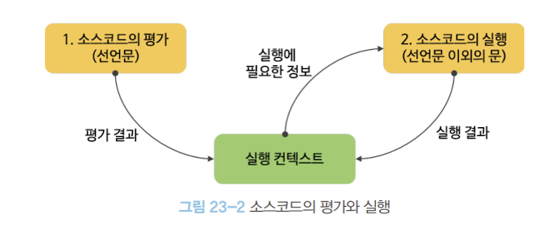

```
var x;
x = 1;
```

변수 선언문 var x;를 먼저 실행하여 변수 식별자 x를 실행 컨텍스트가 관리하는 스코프에 등록하고 undefined로 초기화한다

```
//실행 컨텍스트
x: undefined
```

변수 선언문 var x;는 이미 실행이 완료되었으므로 변수 할당문 x = 1;만 실행된다.

실행 컨텍스트가 관리하는 스코프에 변수 x가 등록되어 있는지 확인함으로써 X에 1을 할당하고 이 할당 결과를 다시 실행 컨텍스트에 등록하여 관리한다.

```
실행 컨텍스트
x: 1
```

#### 정리

소스코드 평가 과정에서 선언문만 먼저 실행하고, 그 결과를 실행 컨텍스트가 관리하는 스코프에 등록한다. 이후 소스코드 실행 과정에서는 실행 컨텍스트에 등록된 식별자를 참조하여 값을 할당하거나 참조하는 등 소스코드를 실행하고, 그 실행 결과는 다시 실행 컨텍스트가 관리하는 스코프에 등록되어 관리된다.

## 실행 컨텍스트의 역할

```
// 전역 변수 선언
const x = 1;
const y = 2;
// 함수 정의
function foo(a) {
// 지역 변수 선언
const x = 10;
const y = 20;
// 메서드 호출
  console.log(a + x + y); // 130
}
// 함수 호출
foo(100);
// 메서드 호출
console.log(x + y); // 3
```

### 전역 코드 평가

- 선언된 변수(전역 변수)와 함수(전역 함수)를 실행 컨텍스트가 관리하는 전역 스코프에 등록한다.
- var로 선언된 전역 변수와 함수 선언문으로 정의된 전역 함수는 전역 객체의 프로퍼티와 메서드가 된다.

### 전역 코드 실행

- 전역 코드가 순차 실행된다. 이때 변수에 값이 할당되고 함수가 호출된다.
- 함수 호출 시 순차 실행을 일시 중단하고 함수 내부로 코드의 제어권이 이동한다.

### 함수 코드 평가

- 매개변수와 지역 변수가 실행 컨텍스트가 관리하는 지역 스코프에 등록된다.
- arguments 객체(지역 변수처럼 사용)가 생성되어 지역 스코프에 등록되고 this 바인딩도 결정된다.

### 함수 코드 실행

- 매개변수와 지역변수에 값이 할당되고 console.log 메서드를 호출한다.
- console 식별자는 스코프 체인을 통해 검색한다. (전역 객체의 프로퍼티)
- console.log 메서드의 인수 표현식(a + x + y)이 평가된 후, console.log 메서드가 호출된다.
- 함수 실행이 종료되면 전역 코드로 되돌아가 계속해서 전역 코드 실행을 이어간다.

실행을 위해서는 스코프, 식별자, 코드 실행 순서 등을 관리해야 하는데 이 모든 것을 제어하는 것이 바로 실행 컨텍스트다.

실행 컨텍스트는 식별자(변수, 함수, 클래스 등)를 등록하고 관리하는 스코프와 코드 실행 순서 관리를 구현한 내부 메커니즘으로, 모든 코드는 실행 컨텍스트를 통해 실행되고 관리된다.

식별자와 스코프는 실행 컨텍스트의 렉시컬 환경으로 관리하고, 코드 실행 순서는 실행 컨텍스트 스택으로 관리한다.

## 실행 컨텍스트 스택

```
const x = 1;
function foo() {
	const y = 2;
	function bar() {
		const z = 3;
		console.log(x + y + z);
	}
	bar();
}
foo(); // 6
```

실행 컨텍스트는 코드의 실행 순서를 관리하기 위해 실행 컨텍스트 스택(콜 스택)이라는 방식을 사용한다.
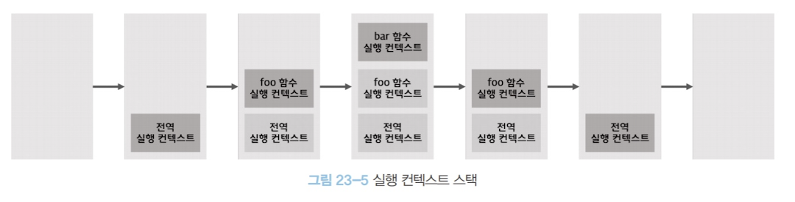

### 전역 코드 평가와 실행

- 전역 실행 컨텍스트가 생성되어 실행 컨텍스트 스택에 push된다.
- 전역 변수 x와 전역 함수 foo가 전역 실행 컨텍스트에 등록된다.
- 전역 코드가 실행되어 x에 값이 할당되고 foo 함수가 호출된다.

### foo 함수 코드 평가와 실행

- foo 함수 실행 컨텍스트가 생성되어 실행 컨텍스트 스택에 push된다.
- foo의 지역변수 y와 중첩함수 bar가 foo 함수 실행 컨텍스트에 등록된다.
- foo 함수 코드가 실행되어 y에 값이 할당되고 bar 함수가 호출된다.

### bar 함수 코드 평가와 실행

- bar 함수 실행 컨텍스트가 생성되어 실행 컨텍스트 스택에 push된다.
- bar의 지역변수 z가 bar 함수 실행 컨텍스트에 등록된다.
- bar 함수 코드가 실행되어 z에 값이 할당되고 console.log 메서드가 실행된 후 종료된다.

### foo 함수 코드로 복귀

-bar 함수가 종료되면 bar 함수 실행 컨텍스트가 실행 컨텍스트 스택에서 pop되어 제거된다.

- foo 함수로 제어권이 이동한다. 더이상 실행할 코드가 없어 foo 함수도 종료된다.

### 전역 코드로 복귀

- foo 함수가 종료되면 foo 함수 실행 컨텍스트가 실행 컨텍스트 스택에서 pop되어 제거된다.
- 전역 코드로 제어권이 이동한다. 더 이상 실행할 전역 코드도 없어 전역 실행 컨텍스트도 실행 컨텍스트 스택에서 pop되어 실행 컨텍스트 스택은 비어진다.

실행 컨텍스트 스택의 최상위에 존재하는 실행 컨텍스트는 언제나 현재 실행 중인 코드의 실행 컨텍스트다. 이를 실행 중인 실행 컨텍스트라 부른다.

## 렉시컬 환경

- 식별자와 식별자에 바인딩된 값, 상위 스코프에 대한 참조를 기록하는 자료구조로, 실행 컨텍스트를 구성하는 컴포넌트다.
- 스코프와 식별자를 관리한다.

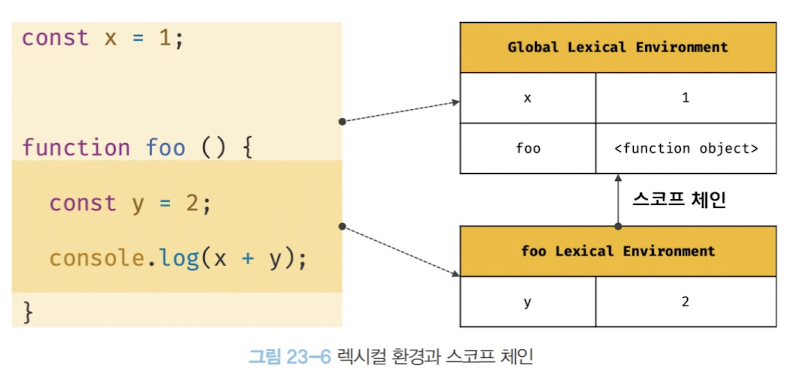

- 키와 값을 갖는 객체 형태의 스코프(전역, 함수, 블록 스코프)를 생성하여 식별자를 키로 등록하고 식별자에 바인딩된 값을 관리한다.

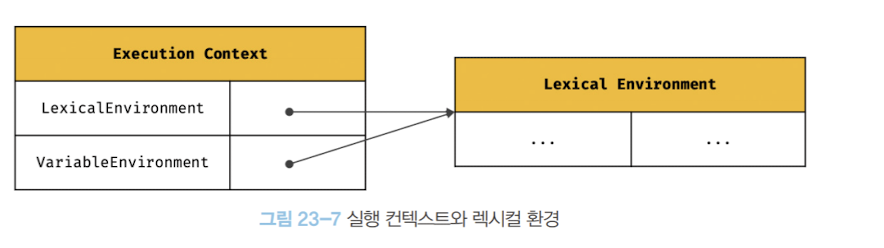
즉, 렉시컬 환경은 스코프를 구분하여 식별자를 등록하고 관리하는 저장소 역할을 하는 렉시컬 스코프의 실체다.

실행 컨텍스트는 LexicalEnvironment 컴포넌트와 VariableEnvironment 컴포넌트로 구성된다. 생성 초기에 두 컴포넌트는 동일한 렉시컬 환경을 참조하지만 몇가지 상황에 따라 달라지기도 한다.

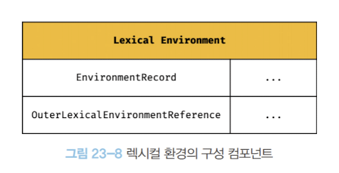

### 환경 레코드(Environment Record)

- 스코프에 포함된 식별자를 등록하고 등록된 식별자에 바인딩된 값을 관리하는 저장소다.
- 소스코드의 타입에 따라 관리하는 내용에 차이가 있다.

### 외부 렉시컬 환경에 대한 참조(Outer Lexical Environment Reference)

- 상위 스코프를 가리킨다.
- 해당 실행 컨텍스트를 생성한 소스코드를 포함하는 상위 코드의 렉시컬 환경을 참조한다.
- 이를 통해 단방향 링크드 리스트인 스코프 체인을 구현한다.

## 실행 컨텍스트의 생성과 식별자 검색 과정

```
var x = 1;
const y = 2;
function foo(a) {
	var x = 3;
	const y = 4;
	function bar(b) {
		const z = 5;
		console.log(a + b + x + y + z);
	}
	bar(10);
}
foo(20); // 42
```

### 전역 객체 생성

자바스크립트 엔진은 가장 먼저 전역 객체를 생성한다. 이 때는 아직 전역 코드를 실행하기 이전이다.

전역 객체에는 빌트인 전역 프로퍼티(Infinity, NaN, undefined)와 빌트인 전역 함수(isFinite, parseInt, eval), 표준 빌트인 객체(Object, String, Number, Array 등)가 추가된다.

클라이언트 사이드 환경(브라우저)에서는 DOM, BOM, Canvas, XMLHttpRequest, Fetch, requestAnimationFrame, SVG, Web Storage, Web Component, Web Worker와 같은 클라이언트 사이드 Web API가 추가로 제공된다.

```
window.toString();  // "[object Window]"
window.__proto__.__proto__.__proto__.__proto__ === Object.prototype;  // true
```

전역 객체도 Object.prototype을 상속받기에 프로토타입 체인의 일원이 된다.

### 전역 코드 평가

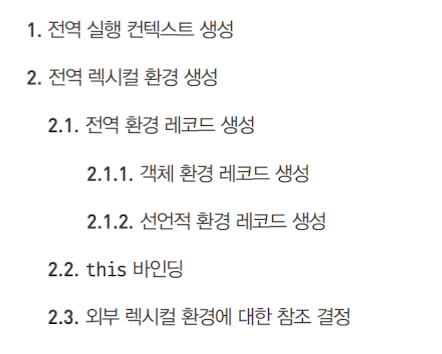
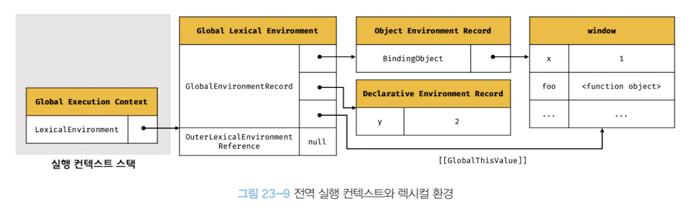

#### 전역 실행 컨텍스트 생성

- 아직 아무 정보도 담고 있지 않은 빈 전역 실행 컨텍스트를 생성하여 실행 컨텍스트 스택에 푸시한다.
- 이 컨텍스트는 이제 실행 중인 실행 컨텍스트(running execution context)가 된다.

#### 전역 렉시컬 환경 생성

- 전역 렉시컬 환경을 생성하고 방금 생성한 전역 실행 컨텍스트에 바인딩한다.
- 렉시컬 환경은 환경 레코드(Environment Record)와 외부 렉시컬 환경 참조(Outer Lexical Environment Reference)로 구성된다.

#### 전역 환경 레코드 생성

전역 렉시컬 환경의 구성요소인 전역 환경 레코드는 전역 변수를 관리하는 전역 스코프이자 최상위 스코프이다. 또한 전역 객체의 빌트인 프로퍼티와 함수, 그리고 표준 빌트인 객체도 여기에 포함된다.

ES6 이전까지는 전역 객체가 전역 환경 레코드 역할을 수행했다. 하지만 let/const로 선언한 전역 변수는 전역 객체의 프로퍼티가 되지 않는다. 따라서 let/const로 선언한 변수를 구분하여 관리할 필요가 있어 ES6부터는 전역 환경 레코드를 객체 환경 레코드와 선언적 환경 레코드로 구분하였다.

#### 객체 환경 레코드 생성

객체 환경 레코드(Object Environment Record)는 BindingObject라는 객체를 통해 var로 선언한 전역 변수와 함수 선언문으로 정의한 전역 함수, 그리고 빌트인 전역 프로퍼티와 함수, 표준 빌트인 객체를 관리한다.

BindingObject는 앞서 생성한 전역 객체에 해당한다. 즉, 객체 환경 레코드에서 관리하는 식별자들은 모두 BindingObject를 통해 전역 객체의 프로퍼티나 메서드가 된다. 예제의 경우 var x와 function foo가 여기에 해당한다.

이런 이유로 var로 선언한 전역 변수나 함수 선언문으로 정의한 전역 함수의 경우 전역 객체 window의 프로퍼티나 메서드처럼 접근할 수 있다.

#### 선언적 환경 레코드 생성

선언적 환경 레코드(Declarative Environment Record)는 let/const로 선언한 전역 변수(let/const로 선언한 변수에 할당한 함수 표현식 포함)를 관리한다.

예제의 경우 const y가 여기에 해당한다. 이 변수는 어떤 '개념적인 블록'에 존재하게 되는데, 이때의 블록이 바로 선언적 환경 레코드다. 선언적 환경 레코드에서 관리하는 식별자들은 전역 객체의 프로퍼티가 되지 않는다. 즉, window.y 식으로 접근할 수 없다.

또한 var와 달리 let/const는 변수 선언 단계와 초기화 단계가 분리되어 진행된다. 따라서 런타임에 변수 선언문에 도달하기 전까지는 참조할 수 없는 TDZ(Temporal Dead Zone, 일시적 사각지대)에 빠지게 된다. 호이스팅이 발생하지 않는 것처럼 보이지만 실제로는 그렇지 않다.

```
let foo = 1;
{
	console.log(foo); // ReferenceError
	let foo = 2;
}
```

호이스팅이 일어나지 않는다면 전역 변수 foo의 값 1이 출력될 것이다. 하지만 블록 레벨 스코프에서 let foo가 호이스팅되어 현재 TDZ에 있으므로 참조 에러가 발생하게 되는 것이다.

#### this 바인딩

전역 환경 레코드의 [[GlobalThisValue]]라는 내부 슬롯에 this가 바인딩된다. 일반적으로 전역 코드에서의 this는 전역 객체를 가리키므로 전역 객체가 바인딩된다.

전역 환경 레코드와 함수 환경 레코드에는 this 바인딩이 존재하지만, 객체 환경 레코드와 선언적 환경 레코드에는 존재하지 않는다.

#### 외부 렉시컬 환경에 대한 참조 결정

외부 렉시컬 환경 참조는 현재 평가 중인 소스코드를 포함하는 외부 소스코드의 렉시컬 환경, 즉 상위 스코프를 가리킨다.

현재 전역 코드를 평가 중이므로, 전역 렉시컬 환경의 외부 렉시컬 환경 참조에는 null이 할당된다. 전역 렉시컬 환경은 스코프 체인의 종점에 위치하기 때문이다.

### 전역 코드 실행

이제 순차적으로 전역 코드를 실행하기 시작한다.
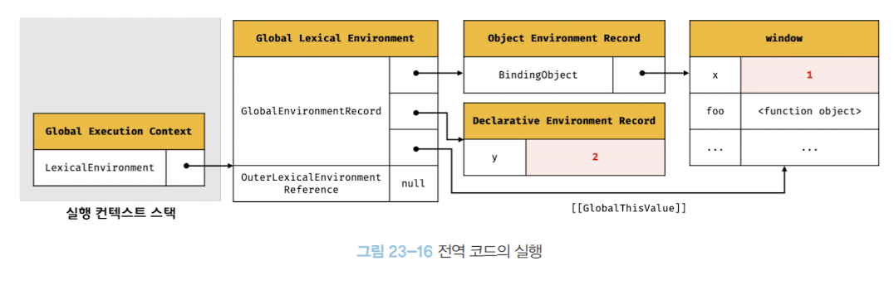
변수 할당문 x = 1과 y = 2가 실행되어 각 변수에 값이 할당된다. 그리고 함수 foo를 호출한다. 이 때 식별자 결정(identifier resolution)을 위해 실행 컨텍스트가 관리하는 스코프, 즉 렉시컬 환경의 환경 레코드에서 식별자를 검색한다.

실행 중인 실행 컨텍스트의 렉시컬 환경에서 식별자를 검색할 때는 아래 순서를 따른다.

현재 실행 중인 컨텍스트의 환경 레코드에서 식별자 검색
상위 스코프로 이동하며 식별자 검색 (외부 렉시컬 환경 참조를 통해)
현재 전역 실행 컨텍스트가 실행 중이므로 전역 환경 레코드(객체 환경 레코드, 선언적 환경 레코드)에서 식별자 x, y와 foo를 검색한다.

식별자가 환경 레코드에서 검색되지 않으면 외부 렉시컬 환경 참조가 가리키는 상위 렉시컬 환경으로 이동하여 식별자를 검색하는데, 이를 통해 스코프 체인을 구현한다.

전역 렉시컬 환경은 스코프 체인의 종점에 존재하므로, 전역 렉시컬 환경에서도 식별자를 검색할 수 없다면 참조 에러(ReferenceError)가 발생하게 된다.

### foo 함수 코드 평가

앞서 전역 코드 평가를 통해 전역 실행 컨텍스트가 생성되었고, 현재는 전역 코드를 실행하는 중이다. 지금 시점은 foo 함수를 호출하기 직전이다.

```
var x = 1;
const y = 2;

function foo(a) {
	var x = 3;
	const y = 4;

	function bar(b) {
		const z = 5;
		console.log(a + b + x + y + z);
	}
	bar(10);
}

foo(20); // 호출 직전
```

이제 foo 함수가 호출되면 전역 코드의 실행은 일시 중단되고, 코드의 제어권은 foo 함수 내부로 이동한다. 그리고 함수 코드를 평가하기 시작하는데, 그 순서는 다음과 같다.

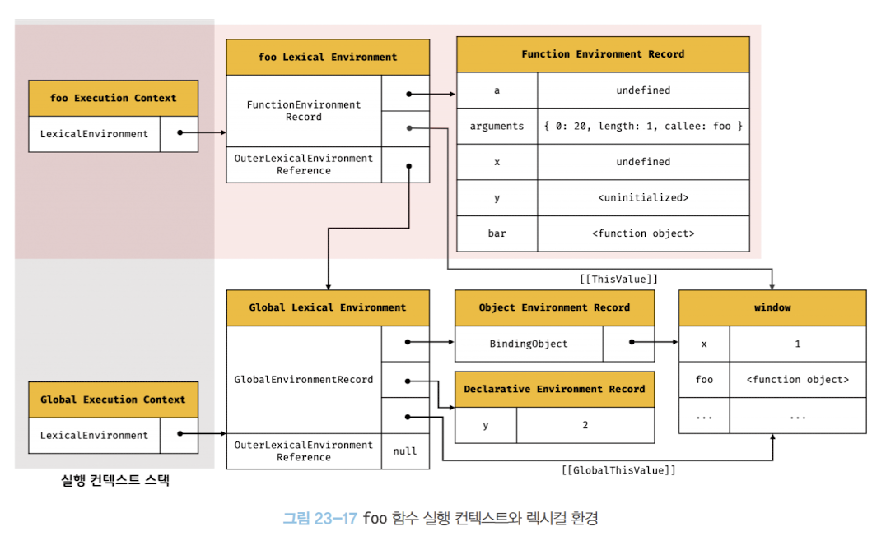

### 함수 실행 컨텍스트 생성

먼저 foo 함수의 실행 컨텍스트를 생성한다. 생성된 함수 실행 컨텍스트는 함수 렉시컬 환경의 구성이 완료된 후 실행 컨텍스트 스택에 푸시된다.

이때 foo 함수 실행 컨텍스트는 스택의 최상단에 위치하게 되며, 현재 실행 중인 실행 컨텍스트가 된다.

### 함수 렉시컬 환경 생성

foo 함수 렉시컬 환경(Function Lexical Environment)을 생성하고, 앞서 생성한 foo 함수 실행 컨텍스트에 바인딩한다.
렉시컬 환경은 환경 레코드와 외부 렉시컬 환경에 대한 참조로 구성된다.

#### 1. 함수 환경 레코드 생성

함수 렉시컬 환경을 구성하는 첫번째 컴포넌트인 함수 환경 레코드는 매개변수, arguments 객체, 함수 내부에서 선언한 지역 변수와 중첩 함수 등을 등록하여 관리한다.

예제의 경우 매개변수 a, arguments 객체, 지역 변수 x, y 그리고 중첩 함수 bar가 함수 환경 레코드에 바인딩된다.

#### 2. this 바인딩

함수 환경 레코드의 [[ThisValue]] 내부 슬롯에 this가 바인딩된다.

foo 함수는 일반 함수로서 호출되었으므로 함수 내부의 this는 전역 객체를 가리킨다. 일반 함수로 호출된 모든 함수(중첩함수, 콜백함수 포함) 내부의 this에는 전역 객체가 바인딩된다.

#### 3. 외부 렉시컬 환경에 대한 참조 결정

foo 함수는 전역 코드에 정의된 전역 함수다. 따라서 foo 함수의 상위 스코프는 전역 스코프다.

즉, foo 함수 정의가 평가되는 시점은 전역 코드 평가 시점이며, 이때 실행 중인 실행 컨텍스트는 전역 실행 컨텍스트다.

그러므로 foo 함수 렉시컬 환경의 외부 렉시컬 환경에 대한 참조에는 전역 렉시컬 환경에 대한 참조가 할당된다.

일반적으로 함수의 상위 스코프는 함수를 어디서 정의했는지에 따라 결정된다. 함수를 어디서 호출했는지는 함수의 상위 스코프 결정에 어떤 영향도 주지 않는다.

자바스크립트 엔진은 함수 정의를 평가하여 함수 객체를 생성할 때 현재 실행 중인 실행 컨텍스트의 렉시컬 환경(상위 스코프)을 함수 객체의 내부 슬롯 [[Environment]]에 저장한다.

함수 렉시컬 환경의 외부 렉시컬 환경에 대한 참조에 할당되는 것은 바로 함수 객체의 내부 슬롯 [[Environment]]에 저장된 렉시컬 환경의 참조다. 이것이 바로 렉시컬 스코프를 구현하는 메커니즘이다.

### foo 함수 코드 실행

foo 함수 코드 평가 과정이 끝나면 런타임이 시작된다. foo 함수의 소스코드가 순차적으로 실행되기 시작하는 것이다.

먼저 매개변수 a에 인수 20이 할당되고, 변수 할당문이 실행되어 지역 변수 x와 y에 각각 3과 4가 할당된다. 그리고 중첩 함수 bar가 호출된다.

이때 변수 할당문 실행 등을 위해 식별자 결정을 한다. 즉, 현재 실행 중인 실행 컨텍스트(함수 실행 컨텍스트)의 렉시컬 환경에서 식별자를 검색하는 것이다.

예를 들어, 변수 x에 값을 할당하려 할 때 현재 실행 중인 함수 실행 컨텍스트의 렉시컬 환경에서 먼저 식별자 x를 검색한다.

검색된 식별자에 값 3을 바인딩한다. y도 마찬가지다.

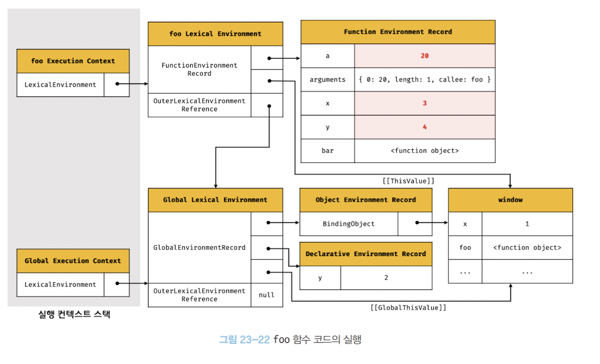

### bar 함수 코드 평가

지금까지 foo 함수 코드 평가를 통해 foo 함수의 실행 컨텍스트가 생성되었고, foo 함수 코드를 실행하는 중이다. 현재 진행 상황은 foo 함수 내부에서 중첩 함수 bar를 호출하기 직전이다.

```
function foo(a) {
	var x = 3;
	const y = 4;

	function bar(b) {
		const z = 5;
		console.log(a + b + x + y + z);
	}
	bar(10); // 호출 직전
}
```

bar 함수가 호출되면 bar 함수 내부로 코드의 제어권이 이동하고, bar 함수 코드를 평가하기 시작한다.

실행 컨텍스트의 생성과 렉시컬 환경의 구성 과정 등은 앞서 살펴본 foo 함수 코드 평가 과정과 동일하게 진행된다.

다만 bar 함수는 foo 함수 내부에서 정의된 중첩 함수다. 따라서 bar 함수의 상위 스코프는 foo 함수의 스코프이고, 렉시컬 환경의 외부 렉시컬 환경에 대한 참조에는 foo 함수의 렉시컬 환경이 참조된다.

생성된 bar 함수의 실행 컨텍스트와 렉시컬 환경은 아래와 같다. 위 과정을 통해 코드의 실행 순서와 식별자 결정, 스코프 등이 관리된다.

실행 컨텍스트 스택을 통해 코드의 실행 순서가 관리되고, 렉시컬 환경을 통해 식별자와 스코프가 관리되는 것이다.

함수 호출이 종료되면 함수의 실행 컨텍스트는 실행 컨텍스트 스택에서 팝되어 제거되고, 코드의 제어권은 caller 함수로 돌아간다.

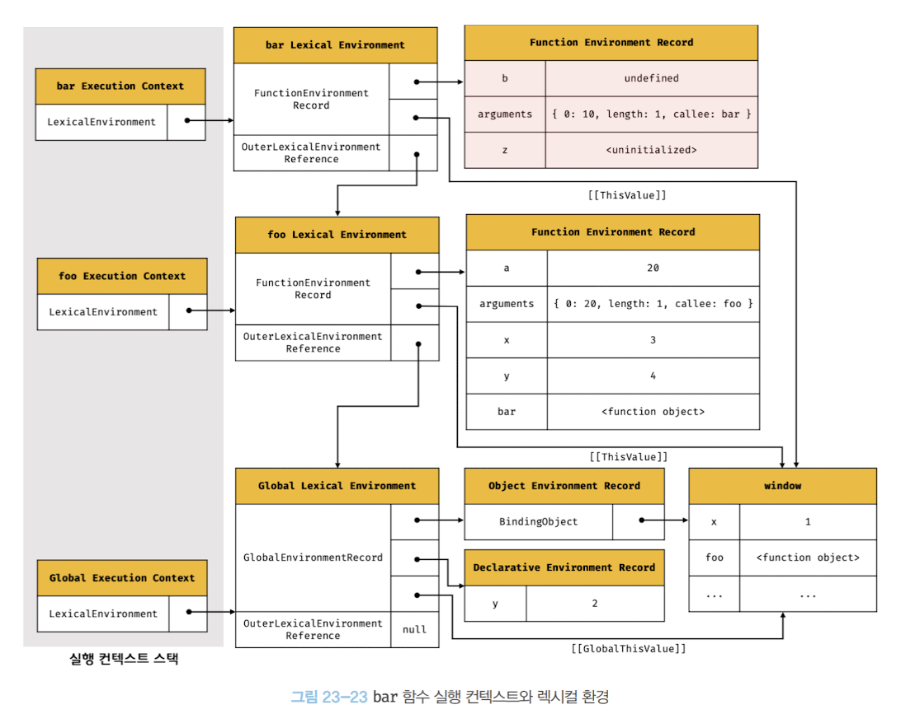

### bar 함수 코드 실행

foo 함수 코드 평가를 통해 foo 함수 실행 컨텍스트가 생성되었고, 현재는 foo 함수를 실행하는 중이다. 지금 시점은 bar 함수를 호출하기 직전이다.

bar 함수가 호출되면 코드의 제어권은 bar 함수 내부로 이동한다. 그리고 bar 함수 코드를 평가하기 시작하고 이를 통해 bar 함수의 실행 컨텍스트와 렉시컬 환경이 생성된다.

이제 bar 함수의 소스코드가 순차적으로 실행되기 시작한다. 매개변수 b에 인수 10이 할당되고, 변수 할당문이 실행되어 지역 변수 z에 5가 할당된다.

그리고 console.log(a + b + x + y + z);가 실행되는데 이 과정은 다음과 같다.

#### 1. console 식별자 검색

스코프 체인에서 console 식별자를 검색하기 시작한다. 현재 실행 중인 실행 컨텍스트인 bar 함수 실행 컨텍스트의 렉시컬 환경에는 console 식별자가 없으므로 스코프 체인 상에서 외부 렉시컬 환경에 대한 참조를 통해 상위 렉시컬 환경으로 이동한다.
전역 렉시컬 환경에 도착했을 때 객체 환경 레코드의 BindingObject를 통해 전역 객체에서 console 식별자를 검색할 수 있다.

#### 2. log 메서드 검색

console 식별자에 바인딩된 객체, 즉 console 객체에서 log 메서드를 검색한다. 이때 console 객체의 프로토타입 체인을 통해 메서드를 검색하게 되는데, log 메서드는 console 객체가 직접 소유한 프로퍼티이므로 여기서 검색이 종료된다.

```
console.hasOwnProperty('log'); // true
```

#### 3. 표현식 a + b + x + y + z의 평가

console.log 메서드에 전달할 인수인 표현식 a + b + x + y + z를 평가하기 위해 스코프 체인에서 각각의 식별자를 검색한다.
식별자 a는 foo 함수 렉시컬 환경에서, 식별자 b는 bar 함수 렉시컬 환경에서, 식별자 x와 y는 foo 함수 렉시컬 환경에서, 식별자 z는 bar 함수 렉시컬 환경에서 검색된다.

#### 4. console.log 메서드 호출

표현식 a + b + x + y + z가 평가되어 생성된 값 42를 console.log 메서드에 전달하여 호출한다.
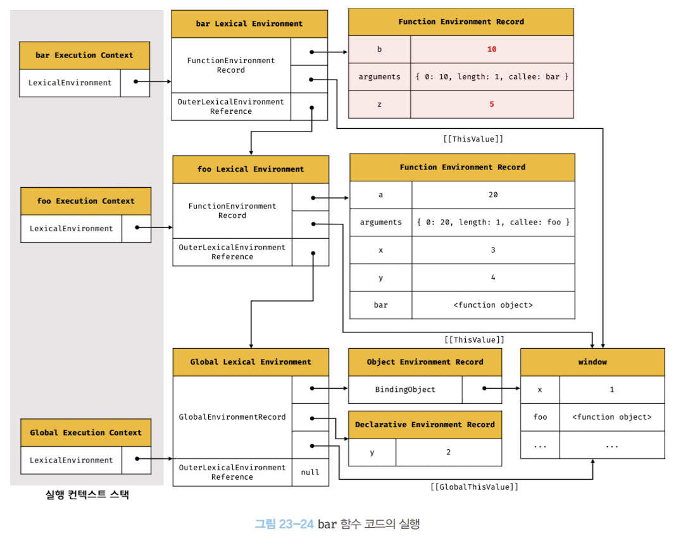

### bar 함수 코드 실행 종료

console.log 메서드의 실행이 종료되면 더 이상 실행할 코드가 없으므로 bar 함수 코드의 실행이 종료된다. 이때 실행 컨텍스트 스택에서 bar 함수 실행 컨텍스트가 팝(pop)되어 제거되고, foo 함수 실행 컨텍스트가 실행 중인 실행 컨텍스트가 된다.

그런데 여기서 주의할 점이 있다. bar 함수의 실행 컨텍스트가 제거되었다고 해서 bar 함수의 렉시컬 환경까지 즉시 소멸하는 것은 아니라는 것이다.

실행 컨텍스트는 렉시컬 환경을 참조하지만, 렉시컬 환경은 실행 컨텍스트와는 독립적인 객체다. 객체를 포함한 모든 값은 누군가에 의해 참조되지 않을 때 비로소 가비지 컬렉터에 의해 메모리 공간의 확보가 해제되어 소멸된다.

### foo 함수 코드 실행 종료

중첩 함수 bar가 종료되고 나면 foo 함수 내부에도 더 이상 실행할 코드가 없으므로 foo 함수 코드의 실행이 종료된다.

이때 실행 컨텍스트 스택에서 foo 함수 실행 컨텍스트가 팝되어 제거되고, 전역 실행 컨텍스트가 실행 중인 실행 컨텍스트가 된다.
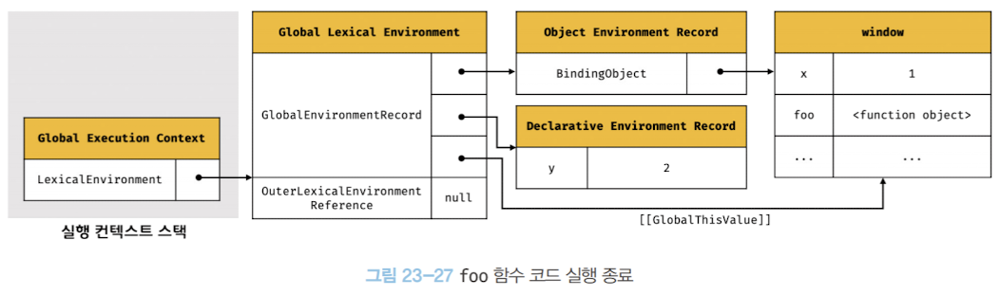

### 전역 코드 실행 종료

foo 함수까지 종료되면 더 이상 실행할 전역 코드가 없으므로 전역 코드의 실행이 종료되고, 전역 실행 컨텍스트도 실행 컨텍스트 스택에서 팝되어 실행 컨텍스트 스택에는 아무것도 남아있지 않게 된다.

### 실행 컨텍스트와 블록 레벨 스코프

var 키워드로 선언한 변수는 오직 함수의 코드 블록만을 지역 스코프로 인정하는 함수 레벨 스코프를 따른다. 반면에 let이나 const 키워드로 선언한 변수는 모든 코드 블록(함수, if문, for문, while문, try/catch문 등)을 지역 스코프로 인정하는 블록 레벨 스코프를 따른다.

```
let x = 1;
if (true) {
	let x = 10;
	console.log(x); // 10
}
console.log(x); // 1
```

if문 내에서 let 키워드로 변수 x를 선언했다. 이는 if문의 블록 레벨 스코프를 생성해야 함을 의미한다. 이를 위해 선언적 환경 레코드를 갖는 렉시컬 환경을 새롭게 생성하여 기존의 전역 렉시컬 환경을 교체한다.

이때 새롭게 만들어진 if문의 렉시컬 환경의 외부 렉시컬 환경에 대한 참조는 if문이 실행되기 이전의 전역 렉시컬 환경을 가리키게 된다.

if문의 실행이 종료되면 이전의 전역 렉시컬 환경으로 되돌아간다. 이러한 방식은 if문 뿐만 아니라 블록 레벨 스코프를 생성하는 모든 문(for, while, try/catch 등)에 적용된다.

특히 for문의 경우, 변수 선언문에 let 키워드를 사용하면 코드 블록이 반복해서 실행될 때마다 코드 블록을 위한 새로운 렉시컬 환경을 생성한다. 이를 통해 변수 값을 유지할 수 있다.

```
for (let i = 0; i < 3; i++) {
	let x = i;
	setTimeout(() => console.log(x), 100);
}
```

for문 내에 정의된 함수의 상위 스코프는 for문의 코드 블록이 생성한 렉시컬 환경이 된다.

이처럼 let이나 const로 선언한 변수는 블록 레벨 스코프를 생성함으로써 그 유효 범위가 블록 내부로 한정된다. 이를 통해 변수 x의 중복 선언을 허용하고(상위 스코프에 같은 이름 변수가 있어도 그것과는 별개로 블록 레벨 스코프 선언 가능) 변수 호이스팅도 방지할 수 있게 된다.
