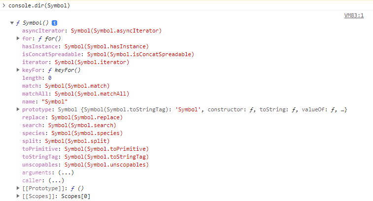
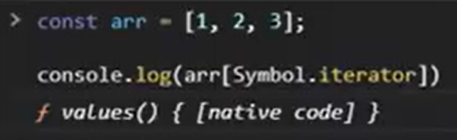

# 34장 이터러블

iterable(이터러블) 객체는 'iterator 객체를 반환하는 함수'를 값으로 갖는
**@@iterator(Symbol.Iterator)** 프로퍼티를 포함해야 한다.



이터러블인지 확인하는 함수

```javascript
const isIterable = (v) =>
  v !== null && typeof v[Symbol.iterator] === "function";

// 배열, 문자열, Map, Set 등은 이터러블이다.
isIterable([]); // true
isIterable(""); // true
isIterable(new Map()); // true
isIterable({}); // false
```

배열은 Array.prototype의 Symbol.iterator 메서드를 상속받는 이터러블이다.
for...of 문으로 순회할 수 있으며, 스프레드 문법과 배열 디스트럭처링 할당의 대상으로 사용할 수 있다.

```javascript
const array = [1, 2, 3];

console.log(Symbol.iterator in array); // true

for (const item of array) {
  console.log(item);
}

console.log([...array]); // [1,2,3]
```

이처럼 순회할 수 있는 이유는 무엇일까?

values가 Symbol.iterator 프로퍼티에 나옴.


values를 호출하게 되면 Iterator 객체를 반환하는 것을 알 수 있다.


이 Iterator 객체를 보면 next 메서드를 포함하는 것을 볼 수 있다.


또 이 next를 호출해 보면 done과 value가 반환 되는 것을 볼 수 있다.

Iterator가 끝에 도달하지 않았다면, done이 false이고 value는 이용 가능하다.

Iterator가 끝에 도달했다면, done은 ture이고, value는 iterator의 반환 값이다.

정리를 하자면 done은 순회 완료 여부, value는 최근 순회 요소를 가리키는 것을 알 수 있다.

## 이터러블과 유사 배열 객체

### 핵심 개념 정리

유사 배열 객체 (Array-like Object): 마치 배열처럼 인덱스로 프로퍼티 값에 접근할 수 있고, length 프로퍼티를 갖는 객체다.

이터러블 (Iterable): Symbol.iterator 메서드를 구현하여 for...of 문으로 순회할 수 있는 객체다.

관계: 유사 배열 객체라고 해서 모두 이터러블인 것은 아니다.

### 유사 배열 객체의 특징과 한계

유사 배열 객체는 length가 있어 for 문으로 순회할 수 있지만, Symbol.iterator가 없기 때문에 for...of 문은 사용할 수 없다.

```javascript
// 유사 배열 객체
const arrayLike = {
  0: 1,
  1: 2,
  2: 3,
  length: 3,
};

// 1. [가능] length가 있으므로 일반 for 문으로는 순회 가능하다.
for (let i = 0; i < arrayLike.length; i++) {
  console.log(arrayLike[i]); // 1 2 3
}

// 2. [불가능] 이터러블이 아니므로(Symbol.iterator 없음) for...of 문은 에러가 발생한다.
for (const item of arrayLike) {
  console.log(item);
}
// TypeError: arrayLike is not iterable
```

### 예외: 유사 배열이면서 이터러블인 객체

arguments, NodeList, HTMLCollection은 본래 유사 배열 객체였으나, ES6에서 Symbol.iterator 메서드가 구현되어 이터러블의 성질도 함께 갖게 되었다.

즉, 이들은 length와 인덱스도 있고, for...of 문도 사용할 수 있는 "하이브리드" 객체다. (배열도 마찬가지다.)

### 해결책: Array.from 메서드

유사 배열 객체 또는 이터러블을 **진짜 배열(Array)**로 변환하고 싶다면 Array.from 메서드를 사용한다. 이를 통해 배열 메서드(map, filter 등)를 자유롭게 사용할 수 있다.

```javascript
// 유사 배열 객체
const arrayLike = {
  0: 1,
  1: 2,
  2: 3,
  length: 3,
};

// Array.from은 유사 배열 객체를 받아 진짜 배열을 반환한다.
const arr = Array.from(arrayLike);

console.log(arr); // [1, 2, 3]

// 이제 배열이므로 for...of 문이나 배열 메서드 사용이 가능하다.
arr.forEach((item) => console.log(item)); // 1 2 3
```

## 무한 이터러블과 지연 평가

### 무한 이터러블 (Infinite Iterable)

이터러블은 데이터 공급자(Provider)의 역할을 한다. 배열이나 문자열 등은 모든 데이터가 메모리에 미리 확보된 상태에서 데이터를 공급하지만, 사용자 정의 이터러블은 내부 상태를 유지하면서 next 메서드를 호출할 때마다 데이터를 생성할 수 있다.

이를 이용하면 데이터를 미리 다 만들어두지 않고, 무한히 데이터를 생성하는 이터러블을 구현할 수 있다.

아래 코드는 done 프로퍼티를 생략하여 무한히 값을 생성하는 이터러블을 구현한 것이다

```javascript
// 1. 피보나치 수열을 구현한 사용자 정의 이터러블을 반환하는 함수
const fibonacciFunc = function () {
  let [pre, cur] = [0, 1]; // 내부 상태 유지 (Closure)

  return {
    // Symbol.iterator 메서드를 구현하여 이터러블 프로토콜 준수
    [Symbol.iterator]() {
      return this;
    },

    // next 메서드를 구현하여 이터레이터 프로토콜 준수
    next() {
      [pre, cur] = [cur, pre + cur];
      // done 프로퍼티를 생략한다. (무한 반복)
      // 결과적으로 이 객체는 영원히 { value: 수열값 } 만을 반환한다.
      return { value: cur };
    },
  };
};

// 2. 무한 이터러블 생성
const iter = fibonacciFunc();

// 3. 이터러블이므로 for...of 문으로 순회 가능
// 주의: 무한 이터러블이므로 반드시 탈출 조건(break)이 필요하다.
for (const num of iter) {
  if (num > 10000) break; // 10,000을 넘으면 종료
  console.log(num); // 1 2 3 5 8 ...
}
```

### 지연 평가 (Lazy Evaluation)

위 예제에서 주목할 점은 데이터가 생성되는 시점이다.

일반적인 배열은 생성되는 순간 모든 요소를 메모리에 할당한다(즉시 평가, Eager Evaluation). 반면, 위 예제의 이터러블은 데이터가 필요한 시점, 즉 next() 메서드가 호출되는 순간에 비로소 데이터를 생성한다. 이를 **지연 평가(Lazy Evaluation)**라 한다.

[지연 평가의 동작 원리]

fibonacciFunc()를 호출했을 때, 이 함수는 단지 이터레이터 객체만 반환할 뿐 실제 숫자는 단 하나도 생성하지 않는다.

for...of 문이나 디스트럭처링 할당이 실행되어 내부적으로 next()를 호출할 때, 비로소 데이터 생성이 시작된다.

필요한 만큼의 데이터를 다 쓰면(예: break 또는 디스트럭처링 완료), 이후의 데이터는 아예 생성하지 않는다.

```javascript
// 무한 이터러블 생성
const fibonacci = fibonacciFunc();

// 배열 디스트럭처링 할당
// 무한히 이어지는 수열이지만, 앞의 3개만 필요하므로
// next()가 딱 3번만 호출되고 멈춘다.
const [f1, f2, f3] = fibonacci;

console.log(f1, f2, f3); // 1 2 3
```

메모리 효율성: 필요한 데이터만 그때그때 생성하므로 불필요한 메모리를 소비하지 않는다. (수만 개의 데이터를 미리 배열로 만들 필요가 없다.)

성능 최적화: 사용하지 않을 데이터는 생성하지 않으므로 실행 속도가 빠르다.

무한 데이터 표현: 메모리 한계에 구애받지 않고 무한한 데이터를 표현할 수 있다.
